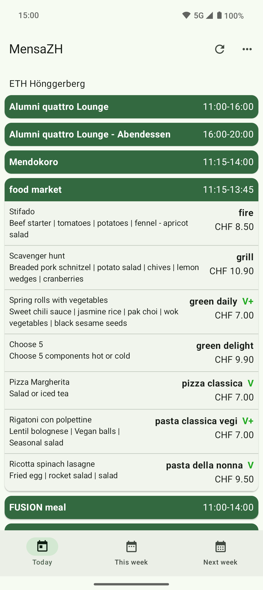
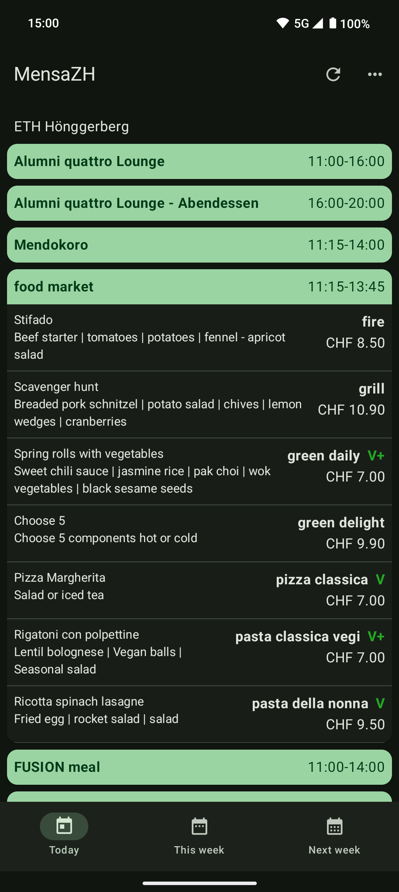
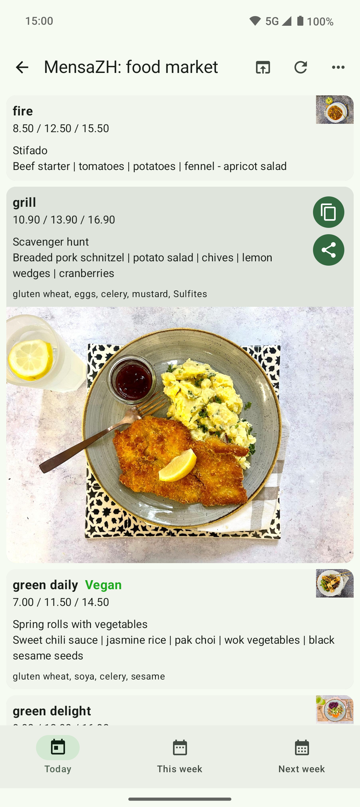
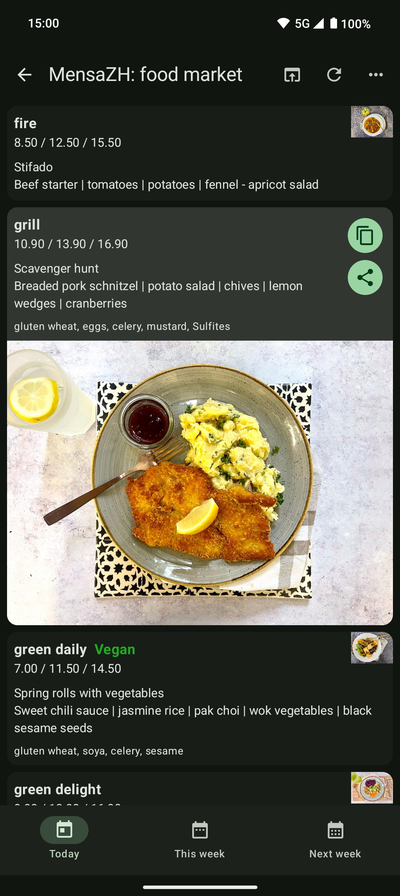
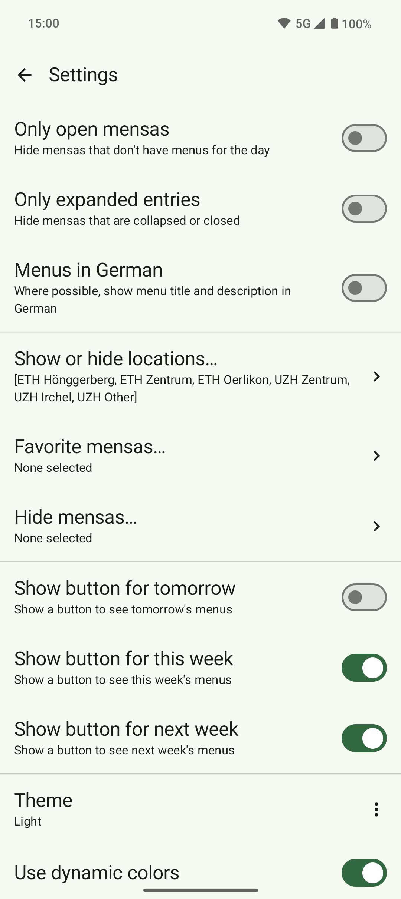
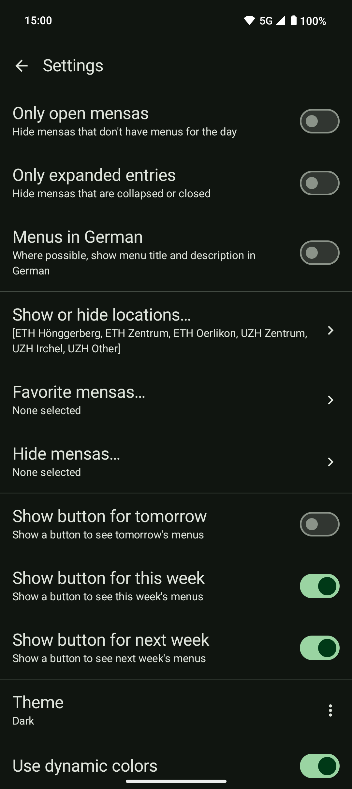
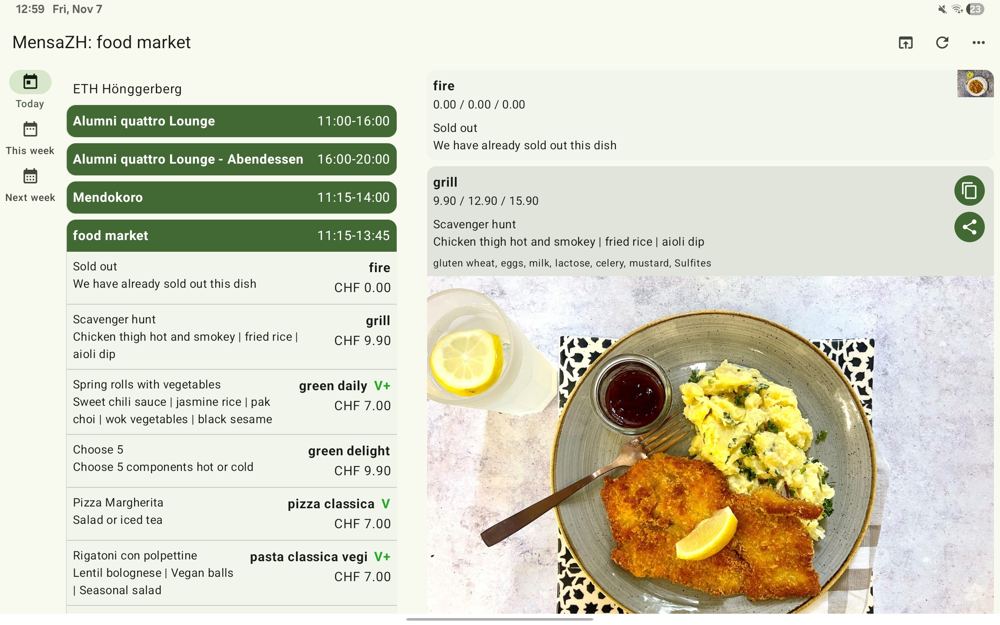
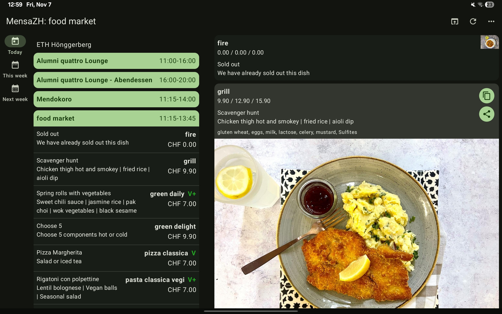

# MensaZH

The menus of all mensas of ETHZ and UZH in Zürich in one app.

<table align="center">
  <tr>
    <td>
      
    </td>
    <td>
       
       
      
    </td>
  </tr>
  <tr>
    <td>
      
    </td>
    <td>
      
    </td>
  </tr>
  <tr>
    <td>
      
    </td>
    <td>
       
     
    
    </td>
  </tr>
</table>

*This app is heavily based on [@famoser's](https://github.com/famoser) work on
his [Mensa app](https://github.com/famoser/Mensa). I modernised and rewrote the app using Jetpack
Compose.*

| Light mode                                                                                    | Dark mode                                                                                  |
|-----------------------------------------------------------------------------------------------|--------------------------------------------------------------------------------------------|
|      |     |
|  |   |
|   |  |
|                  |                 |

## Contributing

I'm grateful for any help! If you want to contribute, check out the more [detailed info on contributing](CONTRIBUTING.md).

---

## Release checklist

- [ ] Update version in code
  - [ ] Verify that the [GitHub build](https://github.com/fflopsi/mensa-zh/actions/workflows/android.yml) passes
  - [ ] Update `versionCode` and `versionName` in `app/build.gradle.kts`
  - [ ] Summarise changes in `metadata/[lang]/changelogs`
- [ ] Play Store update
  - [ ] Generate signed `abb` app bundle
  - [ ] Create a new release on Play Console  and attach the signed app bundle
- [ ] F-Droid/GitHub update
  - [ ] Generate signed `apk`
  - [ ] Create a new release on GitHub with the `versionName` (tag and title) and attach the signed `apk`
